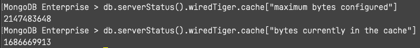
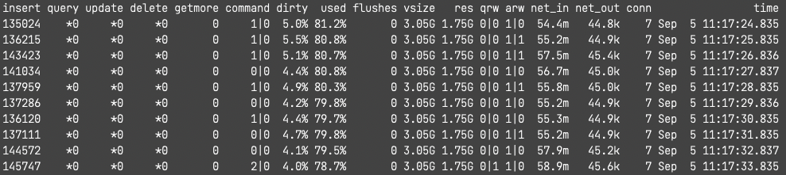
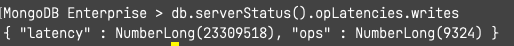

# muniv-m312-vagrant-docker

MongoDB University M312 lab virtual environment for M1 Apple silicon:

> vagrant/virtualbox > docker

- Ubuntu 16.04 arm64
- MongoDB 4.2 arm64 : `mtools` cannot handle new json log files that's been instituted since v4.4

## Requisites

- docker
- docker-compose
- .env: copy `.env.template` to `.env` and set your timezone

## Usage

### Start

`docker-compose up -d`<br>
And check `docker logs --tail 3 m312` shows the following result

```
+ apt-get clean all
+ echo DONE
DONE
```

### Shutdown

`docker-compose down`

### Suspend

`docker-compose pause`

### Resume

`docker-compose unpause`

### Storage

`/home/vagrant` is set for general lab environments but subfolders need to be created according to mongod cfg file per each lab scenario.

Lab 2.1 for example, `/home/vagrant/data` should exist to run `mongod -f single.cfg`

### mtools/mgenerate

Use JS version `mgeneratejs` that is included in this setup.

> Python `mgenerat` is not supported any longer.

`mgeneratejs` does not insert docs for itself.

`mongoimport` can be used to actually load generated docs onto DB.

e.g.

```
mgeneratejs /shared/schema.json -n 100 | mongoimport --drop -c=mgencol -d=m312 -h=localhost:30000
```

### mtools/mplotqueries

`mplotqueries` requies X11 render matplotlib so the host machine needs Xwindow server.

[`XQuartz`](https://www.xquartz.org) (>=2.7.11) supports M1 Apple silicon.

#### Install

> `brew install socat` (instead of ssh)
>
> `brew install --cask xquartz`
>
> > You must log out and back in to effect installation

#### Run

> `open -a XQuartz`
>
> `socat TCP-LISTEN:6000,reuseaddr,fork UNIX-CLIENT:\"$DISPLAY\"`

## Heads-up

### Ch3 Response time degradation, Part1 - Cache use

`mongostat` keeps showing up to 80% cache use even after wiredTiger cache is increased to 2G.




Thus, showing poor write performance



### Ch3 Lab, Building FG index

The shell script for setup, `set_up_building_index_in_foreground.sh` does not work out of the box because

- mlaunch ip binding option(`localhost`)
- mongoimport host option(`m312`)

do not match.

To run the script, either must be corrected.

- add `--bind_ip_all` option to `mlaunch` commandline
- or use `localhost` instead of `m312` for `mongoimport` host option.<br>
  ie. `mongoimport --host m312RS/localhost:30000,...`
